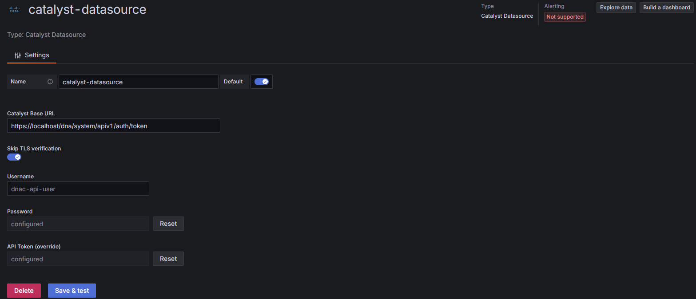

# Catalyst Datasource (Plugin Docs)

Query **Cisco Catalyst Center (formerly DNA Center)** issues/alerts directly from Grafana via the Catalyst REST API.

---

## Features

- Fetch issues from `/dna/intent/api/v1/issues`
- Filter by **Site**, **Device**, **MAC**, **Priority**, **Issue Status**, **AI-driven**, **Limit**
- Return tabular results for Grafana panels
- Variable support for **priorities**, **statuses**, **sites**, **devices**, **macs**
- Secure credentials via Grafana `secureJsonData`
- Go backend + React/TypeScript frontend

---

## Requirements

- Grafana **v12.1.0+**
- Cisco Catalyst Center with API access
- DNAC user credentials or an existing `X-Auth-Token`

---

## Configuration (Data source settings)

- **Catalyst Base URL** — e.g. `https://<host>/dna/intent/api/v1`
- **Skip TLS verification** — only for self-signed certs
- **Username / Password** — used by backend to obtain a short‑lived `X-Auth-Token`
- **API Token (override)** — paste an existing token to bypass login

---

## Query Editor (panels)

Fields:
- **Site ID** — filter by site (UUID)
- **Device ID** — filter by device (UUID)
- **MAC Address** — optional MAC filter (`aa:bb:cc:dd:ee:ff`)
- **Priority** — CSV: `P1,P2,P3,P4`
- **Issue Status** — CSV: `ACTIVE,IGNORED,RESOLVED`
- **AI Driven** — `YES`/`NO` (or any/blank)
- **Limit** — maximum rows returned

Variables are supported in text inputs.

---

## Variable Query Editor (dashboards → Variables)

Types:
- `priorities()`
- `issueStatuses()`
- `sites(search:"<text>")`
- `devices(search:"<text>")`
- `macs(search:"<text>")`

The optional `search` parameter narrows results (supports Grafana variables).

---

## Output

Designed for Grafana **Table** panels. Typical fields include:
- Time, Issue ID, Title
- Priority/Severity, Status, Category
- Device, Site, Rule, Details

---

## Notes

- Make sure the data source can reach Catalyst Center over the network.
- Use TLS verification unless you have a good reason not to.
- For signing & publishing, follow Grafana’s plugin guidelines.

---

## License

Apache-2.0 © extkljajicm
